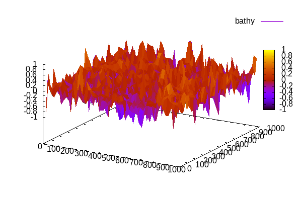
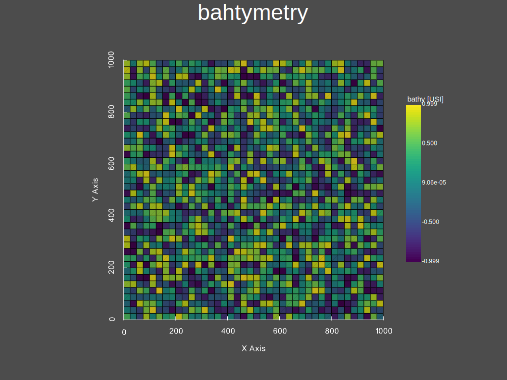
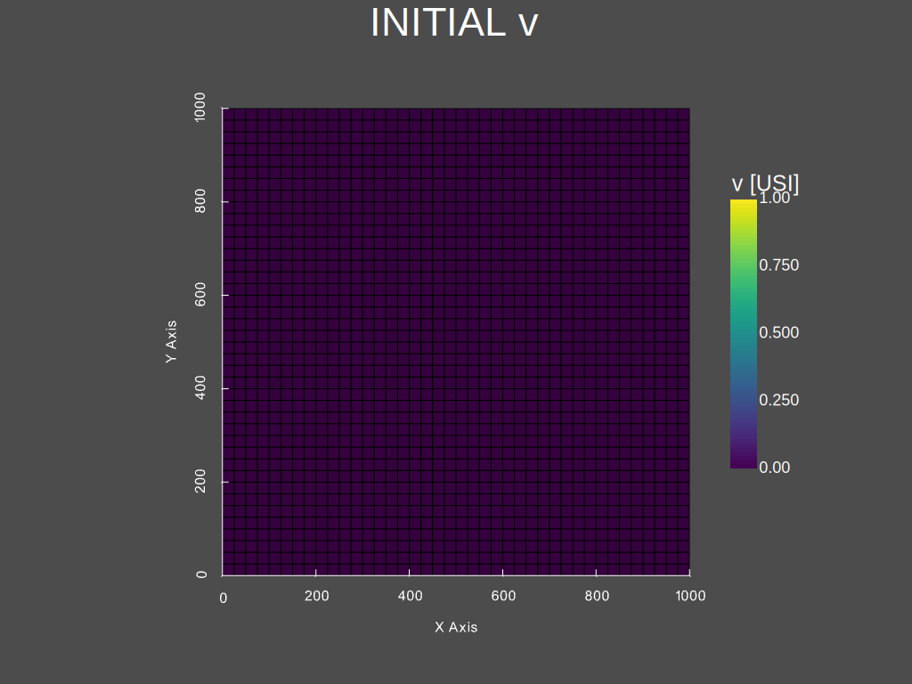
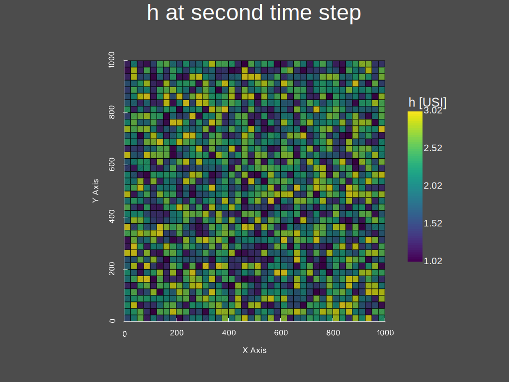

.. _1_make_your_first_run:

===================================
Forward/Direct run
===================================

This tutorial details how to perform a direct/forward run with `dassflow2d`. The 2D SW equations are here solved on an academic case consisting in a lake at rest. **TO_DO ref to eqs & solver used **

The goal of this case is to check whether the equilibrium state is preserved, that is preserving initial states.
More precisely the “Lake at rest” is performed to validate the well-balanced property of the numerical schemes
used in DassFlow. The equilibrium challenged here is the equilibrium between fluxes and gravity source term
:math:`S_g (U)` for a perturbed topography.

.. image:: ./images/mesh_clim.png
  :width: 600

The perturbed topography looks like:

----------------------------------------------
Runnig "lake at rest" with command lines
----------------------------------------------

++++++++++++++++++++++++++++++
Set up your environment
++++++++++++++++++++++++++++++

Prepare the simulation files corresponding to "lake at rest" case with:

.. hint::

	File copy and compilation has just been performed in :ref:`getting_started` introduction, during :ref:`Installation` process. Thus, you don't need to compile the code again.

Open a terminal in (`/dassflow2d-wrap/code`) and run the following commands:

.. code-block:: bash

    # delete all files in your simulation directory before starting
    rm -r ./bin_A/*
    # Copy recursively the files provided in DassFlow case repository into your own simulation directory **code/bin_A/**.
    cp -r ../cases/tuto_case/1_lake-at-rest/bin_A/* ./bin_A

Note that this test case "lake at rest" can be viewed as a stability test case where the well-balancedness of the numerical scheme (see. `Math_num_doc`) is tested in terms of equilibrium preservation. It is a simple test case for which, all the boundaries are set as walls and no inflow or outflow occurs.

++++++++++++++++++++++++++++++++
Launch your first run using make
++++++++++++++++++++++++++++++++

Write the following command in your terminal:

.. code-block:: bash

	make rundirect

This executes some commands coded in the Makefile and printed in the terminal at the beginning of the execution:

.. image:: ./images/tuto1_make_rundirect_initialization.png
  :width: 600

.. image:: ./images/tuto1_make_rundirect_initialization.png
  :width: 600

You should see in the terminal the successive temporal iterations of the numerical resolution of the 2D SW model.

++++++++++++++++++++++++++++++++
Investigate results
++++++++++++++++++++++++++++++++

Have a look to directory ./dassflow2d-wrap/code/bin_A/res/ and investiguate the result files produced (`result_initial.dat` and `result_final.dat`).
These dat files are in gnuplot format (cf. http://www.gnuplot.info/) ; another output format as well as plot tools are available in DassFlow and presented after.

.. NB. ON fera du vtk à partir du hdf5 car "gratos" (Lilian) ; à documenter plus loin

-----------------------------------
Runnig "lake at rest" with Python
-----------------------------------

In `/dassflow2d-wrap/cases/tuto_cases/1_lake-at-rest/` open the script `1_main-tuto_forward_lake_at_rest.py`.

.. code-block:: python

    ##########################################################
    ##########################################################
    # PERFORM A DIRECT SIMULATION WITH  DASSFLOW2D
    # LAKE AT REST
    #
    # Introduction to basic commands to run and visualise simulation reuslt
    ##########################################################
    ##########################################################
    
    #=======================================================#
    # Source librairies
    #=======================================================#
    import dassflow2d as df2d
    import numpy as np
    import os
    import importlib
    
    #=======================================================#
    # copy case file
    #=======================================================#
    
    dassflow_dir = os.path.abspath("../../../") 
    # or absolute path : dassflow_dir =/home/pagarambois/Documents/Distant/dassflow2d-wrap/
    
    print(f"Printing case files \n from {dassflow_dir}/cases/tuto_case/0_lake-at-rest/bin_A/* \n  to  {dassflow_dir}/code/bin_A ")
    
    # delete all files in your simulation directory before starting
    os.system(f"rm -r {dassflow_dir}/code/bin_A/*")
    # Copy recursively the files provided in DassFlow case repository into your own simulation directory **code/bin_A/**.
    os.system(f"cp -r {dassflow_dir}/cases/tuto_case/1_lake-at-rest/bin_A/* {dassflow_dir}/code/bin_A")
    os.chdir( f"{dassflow_dir}/code/")
    os.system("make cleanres cleanmin")
    
    #=======================================================#
    # initialise + run +save results
    #=======================================================#
    
    my_model = df2d.DassFlowModel(bin_dir =  f"{dassflow_dir}/code/bin_A" , run_type = "direct") # initialise fortran/python instance
    my_model.update_fortran() # allocate and initialise many fortran variables
    my_model.run() # run model
    my_model.save_res() # save simulation results in hdf5 files
    my_model.build_grid()  # build a pyvista.unstructuredgrid object, which is used for plots
    
    #=======================================================#
    # Post-processing
    #=======================================================#
    
    # for indication about plot_var method:
    # help(my_model.plot_var)
    
    print("Would you like to plot some model outputs")
    args = input("Press Y or N to continue.") # ajouter exit si pas Y ou N
    
    if args == "Y" or args == "y":
        my_model.plot_var(what = "bathy", when = "initial", title_plot = "bahtymetry", save_plot=True, filename = "./res/bathy")
        my_model.plot_var(what = "h", when = "initial", title_plot = "INITIAL h", save_plot=True, filename = "./res/h_0")
        my_model.plot_var(what = "zs", when = "initial", title_plot = "INITIAL zs", save_plot=True, filename = "./res/zs_0")
        my_model.plot_var(what = "u", when = "initial", title_plot = "INITIAL u", save_plot=True, filename = "./res/u_0")
        my_model.plot_var(what = "v", when = "initial", title_plot = "INITIAL v", save_plot=True, filename = "./res/v_0")
        
        # etc ...
        my_model.plot_var(what = "h", when = 0, title_plot = "INITIAL h")
        my_model.plot_var(what = "h", when = 1, title_plot = "h at second time step", save_plot=True,filename = "./res/h_fin")
        
        # result at the end of the simulation:
        my_model.plot_var(what = "vel", when = "final", title_plot = "norm(u,v) at final time step", save_plot=True,filename = "./res/velocity_fin")
        my_model.plot_var(what = "zs", when = "final", title_plot = "Zs(m) at final time step", save_plot=True,filename = "./res/Zs_fin")
        
     print("Would you like to plot temporal evolution of the free surface")
     args = input("Press Y or N to continue.") # ajouter exit si pas Y ou N
     
     if args == "Y" or args == "y":
         for i in range(11):
             my_model.plot_var(what = "zs", when = i, title_plot = f" h  at wriite timestep= {i}") # water eight
      
     print("Would you like to plot temporal evolution of the velocity")
     args = input("Press Y or N to continue.") # ajouter exit si pas Y ou N
     
     if args == "Y" or args == "y":
        for i in range(11):
            my_model.plot_var(what = "vel", when = i, title_plot = f" norm(u,v) at at wriite timestep= {i}")

.. warning::

  	Note that the location of the dassflow directory has to be defined by setting appropriate value to **dassflow_dir**  at line 13 of the python script: `1_main-tuto_forward_lake_at_rest.py`. A relative path has been set here and enables to run the script locally ; an absolute path enables to run the script in terminal from other directories.

Finaly execute the script in a terminal :

.. code-block:: bash

		python3 "path_to_your_script/name_script.py"

---------------------------------------------------------------------------------------------------------------------
 Running "lake at rest" with Python explained step by step
---------------------------------------------------------------------------------------------------------------------
First, source necessary librairies and define necessary inputs:

.. code-block:: python

  #=======================================================#
  # Source librairies
  #=======================================================#
  import dassflow2d as df2d
  import numpy as np
  import os
  import importlib

  #=======================================================#
  # copy case file
  #=======================================================#
  
  dassflow_dir = os.path.abspath("../../../") 
  # or absolute path : dassflow_dir = "/home/pagarambois/Documents/Distant/dassflow2d-wrap/"

  print(f"Printing case files \n from {dassflow_dir}/cases/tuto_case/0_lake-at-rest/bin_A/* \n  to  {dassflow_dir}/code/bin_A ")

  # delete all files in your simulation directory before starting
  os.system(f"rm -r {dassflow_dir}/code/bin_A/*")
  # Copy recursively the files provided in DassFlow case repository into your own simulation directory **code/bin_A/**.
  os.system(f"cp -r {dassflow_dir}/cases/tuto_case/0_lake-at-rest/bin_A/* {dassflow_dir}/code/bin_A")
  os.chdir( f"{dassflow_dir}/code/")
  os.system("make cleanres cleanmin")

First initialize the Fortran kernel:

.. code-block:: python

	# initialise fortran instance, and python corrponding data
	my_model = df2d.DassFlowModel(bin_dir =  f"{dassflow_dir}/code/bin_A" , arg = "direct")

You sould observe a corresponding console output :

.. image:: ./images/tuto1_initialisationpython.png
  :width: 600

Then you can run the model :

.. code-block:: python

  my_model.update_fortran() # allocate and initialise many fortran variables
	my_model.run()	# run model

The results are calculated at each calculating time steps (depending on ``clf`` condition) and are written at each writting timestep (``dtw`` parameter):

Initial messages from console

.. image:: ./images/tuto1_calc-start.png
  :width: 600

Final messages from console

.. image:: ./images/tuto1_calc-end.png
	:width: 600

Finally you can save the results and perform some plots by executing the last lines of the name_script:

.. code-block:: python

	# save simulation results in hdf5 files
	my_model.save_res()

	my_model.build_grid() # necessary for plots # builds callable objects
	my_model.grid

	#=======================================================#
	# Post-processing
	#=======================================================#

	print("Would you like to plot model outputs")
	args = input("Press Y or N to continue.") # ajouter exit si pas Y ou N

	if args == "Y" or args == "y":
	    my_model.plot_var(what = "bathy", when = "initial", title_plot = "bahtymetry")
	    my_model.plot_var(what = "h", when = "initial", title_plot = "INITIAL h")
	    my_model.plot_var(what = "zs", when = "initial", title_plot = "INITIAL zs")
	    my_model.plot_var(what = "u", when = "initial", title_plot = "INITIAL u", save_plot=True, filename = "./res/u_0")
	    my_model.plot_var(what = "v", when = "initial", title_plot = "INITIAL v", save_plot=True, filename = "./res/v_0")

	    # etc ...
	    my_model.plot_var(what = "h", when = 1, title_plot = "h at second time step")

	    # result at the end of the simulation:
	    my_model.plot_var(what = "vel", when = "final", title_plot = "norm(u,v) at final time step")
	    my_model.plot_var(what = "zs", when = "final", title_plot = "Zs(m) at final time step", save_plot=True,filename = "./res/Zs_fin")

First, you can have a look at the bathymetry and initial conditions (of water heigth and free surface height).

One can note that the initial conditions does not correspond to a state at rest and some time will be necessary before attaining the stationary "at rest" situation

.. image:: ./images/h_0.svg
	:width: 600

.. image:: ./images/zs_0.svg
		:width: 600

.. image:: ./images/u_0.svg
    		:width: 600

You can see at second timestep the evolution of water heigths.

You can also see at the end of the simulation, that the velocities are almost null and the lake remains at rest:

.. image:: ./images/velocity_fin.svg
	:width: 600

.. image:: ./images/Zs_fin.svg
  	:width: 600

By running the last lines of the script, plotting temporal evolution of free surface height and velocity, you can also check that we atteined the stationnary state:

.. code-block:: python

  print("Would you like to plot temporal evolution of the free surface")
  args = input("Press Y or N to continue.") # ajouter exit si pas Y ou N

  if args == "Y" or args == "y":

      for i in range(11):
          my_model.plot_var(what = "zs", when = i, title_plot = f" h  at wriite timestep= {i}")

  print("Would you like to plot temporal evolution of the velocity")
  args = input("Press Y or N to continue.") # ajouter exit si pas Y ou N

  if args == "Y" or args == "y":

      for i in range(11):
          my_model.plot_var(what = "vel", when = i, title_plot = f" norm(u,v) at at wriite timestep= {i}")

=====================================
Use this script for any direct run
=====================================

Using this script one can run any other case by simply providing another case data directory with necessary inputs are provided to DassFlow.

You can change the name of the case data folder ``/cases/tuto_case/0_lake-at-rest`` by ``/cases/dev_case/1_qin`` into the python script 
in the line ``os.system(f"cp -r {dassflow_dir}/cases/tuto_case/0_lake-at-rest/* {dassflow_dir}/code/bin_A")``. Then direct runs can be performed with the other test case specified.

for each test case you run, you can check spatial variables values at any writting timestep using the method ``dassflow2d.DassFlowModel.plot_var`` (you can acess documentation of the method in :ref:`api` section, in DassFLowModel/constructor/plot_var) .

.. danger::

  The last loop on temporal evolution must also be adapted (to the number of writing time steps) or deleted.

.. dropdown:: The plots produced with the case **1_qin** shoud look like this:

      .. image:: ./images/qin/bathy.svg
      	:width: 600

      .. image:: ./images/qin/h_0.svg
      	:width: 600

      .. image:: ./images/qin/zs_0.svg
      		:width: 600

      .. image:: ./images/qin/u_0.svg
          		:width: 600

      .. image:: ./images/qin/v_0.svg
            :width: 600

      .. image:: ./images/qin/velocity_fin.svg
      	:width: 600

      .. image:: ./images/qin/Zs_fin.svg
        	:width: 600
